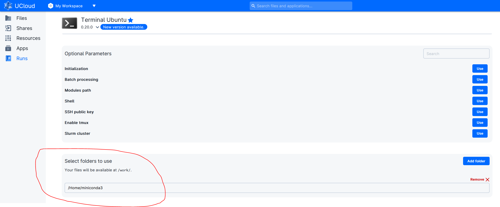

# UCloud Tutorial: Using Conda for easy management of R environments

https://docs.cloud.sdu.dk/hands-on/conda-setup.html?highlight=conda

The Conda package and environment management system is already included in few applications available on UCloud (see, e.g., JupyerLab and PyTorch). For more general uses of Conda and its powerful package manager it is convenient to create a local installation and save it in a UCloud project.
Conda is included in all versions of Anaconda and Miniconda. For example, to install the latest version of Miniconda, just start any interactive app on UCloud, such as Terminal, and run the following shell commands:

# Installing Conda on UCloud

### Launch a "Terminal App" UCloud Job

Run following commands in the terminal: 


```R

# Download miniconda 
curl -s -L -o /tmp/miniconda_installer.sh https://repo.anaconda.com/miniconda/Miniconda3-latest-Linux-x86_64.sh

# Install miniconda
bash /tmp/miniconda_installer.sh -b -f -p /work/miniconda3
```

### When the job is finished copy the “miniconda3” folder from UCloud “Job” folder to a folder you want within your UCloud project.



## Activating Conda in a new UCloud Job


```R
#Running a new UCloud run the following lines in the terminal to activate Conda:
sudo ln -s /work/miniconda3/bin/conda /usr/bin/conda

# Initiate Conda and reboot 
conda init && bash -i
```


```R
#Shows already installed environments:
conda env list
```

## Installing and activate R environments
https://docs.anaconda.com/free/anaconda/packages/using-r-language/


```R
# Installing a R environment
conda create -n  myenv r-essentials r-base

#Shows already installed environments ("myenv" should be displayed)
conda env list

#Activate environment
conda activate myenv

#Check which R is in path
which R

#Output should be: 
/work/miniconda3/envs/myenv/bin/R
```

### install packages through Conda

When using conda to install R packages, you will need to add r- before the regular package name:


```R
# For instance, if you want to install rbokeh:
conda install r-rbokeh

# or for rJava:
conda install r-rjava

# Update packages:

conda update r-caret
```

### Start R and run code or install packages:


```R
# Install packages:
R install.packages(“tidymodels”)

# If the user wish to run this environment with “JupyterLab” then it is advised to install “iRkernel” at this point:
R install.packages("IRkernel")
```

# R Studio on UCloud

### Add the “miniconda3” folder when starting the new Rstudio UCloud job. 

Make sure that Rstudio UCloud job is based on the save R version ad the installed Conda R environment (“myenv”).

Navigate to the R console: 


```R
# Setting "myenv" library into library path of the active R kernel 
.libPaths("/work/miniconda3/envs/myenv/lib/R/library")

# Check if right path is set: 
.libPaths()

# Now "myenv" packages are available and new packages can be installed:
install.packages("googlesheets4")
```

### Be attentive that some dependencies may be pre-installed in the “R studio” UCloud job which may be missing when loading this packages in another UCloud app (e.g. Terminal or JupyterLab app).

# JupyterLab on UCloud

### Add the “miniconda3” folder when starting the new JupyterLab UCloud job.

In terminal add conda environment:


```R
# Init conda:
conda init && bash -i

# JupyterLab app on UCloud is Conda based with a installation found on the following path: 
conda info –-envs

# Output should be: 
/opt/conda

# Create symbolic link for R environment between the two conda installations: 
sudo ln -s /work/miniconda3/envs/myenv /opt/conda/envs

# Shows already installed environments (Now “myenv” is available):
conda env list

# Activate environment:
conda activate myenv
```


```R
# Install iRkernel R package:

R install.packages("IRkernel") # Can be problematic to install at this point
R -e "IRkernel::installspec(name = 'myenv', displayname = 'myenv')"
```


```R
# De-activate environment:
conda deactivate
```

### Now you can launch JupyterLab interface and the “myenv” environment should be available on the frontpage.


# Terminal app on UCloud

### Add the “miniconda3” folder when starting the new Terminal App UCloud job.


```R
# Running a new UCloud run the following lines in the terminal to activate Conda:
sudo ln -s /work/miniconda3/bin/conda /usr/bin/conda

# Init Conda:
conda init && bash -i

# Shows already installed environments:
conda env list

# Activate environment:
conda activate myenv

# Check which R is in path:
which R

# Output should be: 
/work/miniconda3/envs/myenv/bin/R

```


```R
# Start R and run code or install packages:
R install.packages(“tidymodels”)

```
