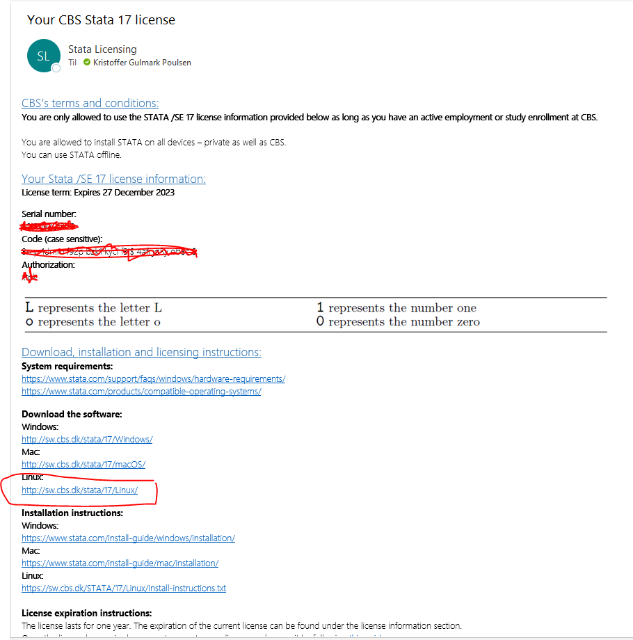
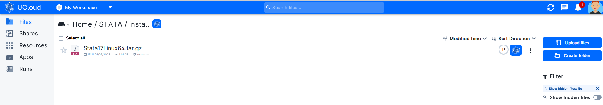
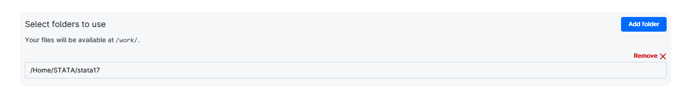
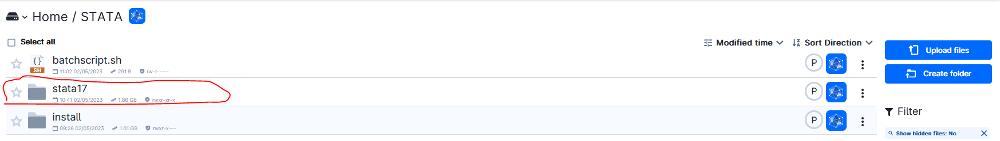

# Install Stata on UCloud

This is a guide on how to install Stata on UCloud.

## Get Stata license and Installation file (CBS Users)

Follow the instructions to get a Stata license at CBS https://studentcbs.sharepoint.com/sites/ITandCampus/SitePages/en/Free-software.aspx

You will recieve an email with license and installation information (see image below).



 Download the installation file (Stata17Linux64.tar) and upload this to your UCloud directory.




## Installing Stata on UCloud

### Launch a "Terminal App" UCloud Job and include the stata installation file (Stata17Linux64.tar)



Run following commands in the terminal: 

```R
# Install dependencies
sudo dpkg --add-architecture i386
sudo apt-get update
sudo apt-get install libncurses5 libncurses5:i386 -y

# Unzip installation file to temp folder
sudo -s
mkdir /tmp/statafiles
cd /tmp/statafiles
tar -zxf /work/install/Stata17Linux64.tar.gz

# Install Stata on in "/work/stata17". Say yes when asked during installtion
mkdir /work/stata17 
cd /work/stata17 
/tmp/statafiles/install

# Set stata to Unix path
export PATH="/work/stata17:$PATH"

# Initialize Stata
sudo /work/stata17/stinit

# Follow instructions and add "Serial number", "Code" and "Authorization" from the Stata license mail

# Check stata installation
which stata

# Run stata
stata 
# or
stata-se
# or
stata-mp
```

### End job and copy the “stata17” folder from UCloud “Job” folder to a folder you want within your UCloud directory.



## Activate Stata installation in a new terminal job

Add the stata17 folder to the job


```R
# Install dependencies
sudo dpkg --add-architecture i386
sudo apt-get update
sudo apt-get install libncurses5 libncurses5:i386 -y

# Set stata to Unix path
export PATH="/work/stata17:$PATH"

# Check stata installation
which stata

# Run stata
stata 
# or
stata-se
# or
stata-mp
```