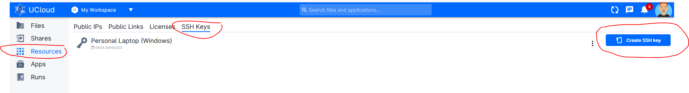
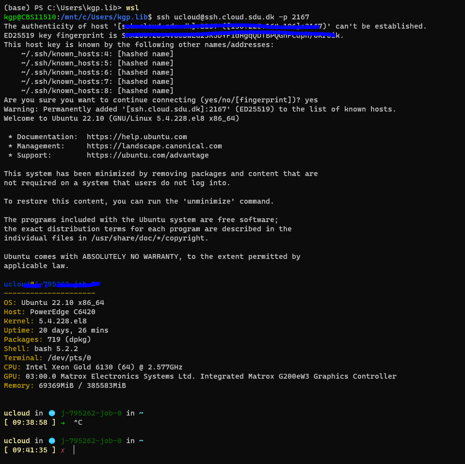

# UCloud Tutorial: Transfer large data to UCloud using Rsync

Rsync, short for "remote synchronization," is a powerful and widely used file synchronization and transfer utility. It enables efficient copying and updating of files between different locations, whether they are on the same system or across a network. Rsync is particularly valuable for managing large data sets or performing incremental backups.

What sets Rsync apart is its ability to synchronize files by transferring only the differences between the source and destination files. This delta transfer mechanism greatly reduces the amount of data that needs to be transmitted, making Rsync highly efficient, even for large files or slow network connections.

Rsync also offers several advanced features, such as compression, encryption, and the ability to preserve various file attributes, such as permissions, timestamps, and symbolic links. It supports both local file copying and remote transfers via SSH, allowing secure synchronization between different systems.

With its flexibility, speed, and efficient use of network resources, Rsync has become a go-to tool for tasks like backup and mirroring, remote file distribution, and content deployment. It has a command-line interface, making it scriptable and suitable for both one-time transfers and automated, scheduled tasks.


[UCloud documentation on Rsync](https://docs.cloud.sdu.dk/Apps/rsync.html)

# Installing Ubuntu on local machine (For Windows)

Rsync is not natively available for Windows. However, you can install Rsync on Windows using a third-party implementation such as Cygwin or DeltaCopy. Alternatively, you can install Ubuntu on Windows which then comes whic includes Rsync.

In this guide we will use Rsync through Ubuntu. For more infomation and video tutorials can be found [here](https://www.google.com/search?client=firefox-b-d&q=install+rsync+on+windows#fpstate=ive&vld=cid:da30000b,vid:qJN9mb8fjDM).


## Create a SSH-key within your Ubuntu environment

Despite already having a shh-key (in your windows environment) the easiest will be to create a new SSH-key within your Ubuntu environment. Open a terminal and follow the few steps below.

More information on how to generate a SSH key can be found [here](/Tutorials/VMs/shh/)


```R
# Activate Ubuntu 
wsl

# For linux only 
sudo apt install openssh-client

# Create key
ssh-keygen

# Output: 
Generating public/private rsa key pair.
Enter file in which to save the key (C:\Users\user/.ssh/id_rsa): # press enter
Enter passphrase (empty for no passphrase):                         # press enter
Enter same passphrase again:                                        # press enter
Your identification has been saved in /home/user/.ssh/id_rsa.
Your public key has been saved in /home/user/.ssh/id_rsa.pub.
The key fingerprint is:
SHA256:V4jnGjEIpUYU4tghvdfdkJj+hnd8t/E70SNGdsdepmX7E ggs\use@CBSxxxx
The key's randomart image is:
+---[RSA 3072]----+
|o o.=o....       |
|+O++.o . .. .    |
|=+=*o .. + o .   |
|..oo.    = + .   |
| ..o . .S = o o  |
|  o . o .O o E   |
|       o= . + .  |
|   ..   .  = .   |
|         .. o    |
+----[SHA256]-----+


```

## Copy public SSH-key


```R
# Open Public Key
vim /home/user/.ssh/id_rsa.pub

# highlight public key with mouse and copy using "ctrl+c"
```


## Add public SSH key to UCloud

### Step 1: On UCloud go to "Resources -> SHH-Keys -> Create SSH key" 



### Step 2: Paste pulic key, give a meaningful name and press "Add SSH key". 


More information can be found in the UCloud [documentation](https://docs.cloud.sdu.dk/Apps/general_settings.html#configure-ssh-access).


## Start Rsync Job

### Step 1: Start Rsync Job by filling out the necessary fields


### Step 2: When job ready please locate the SSH port which is randomly generated. In the cas below the SHH port is 2167.


## Connect from local machine using SSH.

Open Terminal and follow steps below.


```R
# Activate Ubuntu (for Windows)
wsl

# SHH connect using the command marked with in the figure above.
ssh ucloud@ssh.cloud.sdu.dk -p 2167

```

If sucessfull you should get the output shown in the figure below.



## Transfer data using Rsync


```R
# Navigate to path contain the folder of files to transfer - Alternatively you can open terminal directly in the right directory to skip step below.
cd "path/of/folders-or-files" 

# Activate Ubuntu (for Windows)
wsl

# SSH transfer "myfolder" to /work directory on UCloud 

rsync -avP -e "ssh -i ~/.ssh/id_rsa -p 2167" ./myfolder/ ucloud@ssh.cloud.sdu.dk:/work/myfolder 
```
