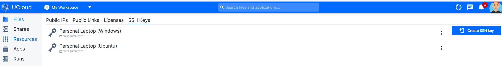
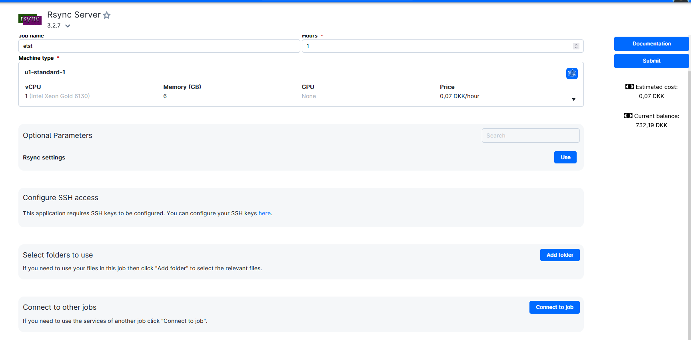

# UCloud Tutorial: Transfer large data to UCloud using Rsync

This application is used to deploy an rsync server, which is a utility to efficiently transfer and synchronize files and directories between two different systems

[UCloud documentation on Rsync](https://docs.cloud.sdu.dk/Apps/rsync.html)

# For Windows Installing Ubuntu on local machine (For Windows)

Video Tutorial found [here](https://www.google.com/search?client=firefox-b-d&q=install+rsync+on+windows#fpstate=ive&vld=cid:da30000b,vid:qJN9mb8fjDM)


## Add public SSH key to UCloud

Information on how to generate a SSH key can be found [here](https://github.com/CBS-HPC/Tutorials/blob/main/VMs/shh.ipynb)

Copy the public SSH key (.pub file) to UCloud.


## Apply for a Public IP on UCloud

A UCloud public IP is need to use Rsync. This can be obtained through a [UCloud grant application](https://github.com/CBS-HPC/.github/blob/main/profile/GrantApp.md) by filling out the field shown below:


The application subsequently needs to be accepted by CBS front office personal.

## Start Rsync Job and Configure Ports for Public IP'

Fill out "Job name","Hours", "Machine type".


### Step 1: Select the "Public IP", "SSH Public Key" & "Rsync Volume" fields

- "Public IP" - see steps below.
- "SHH Public Key" - Select the .pub file you have just uploaded to UCloud.
- "Rsync Volume" - Select the UCloud folder where the files/folders should be transferred to.


### Step 2: If no Public IPs are activated press "Create public ip"


### Step 3: Select the "public-ip" product


### Step 4: press the "3 dots button" and select "Properties".


### Step 5: Open the firewall for ports 22 and 873 as shown below: 


### Step 6: Select the configured Public IP


### Step 7: Start the Job 


#### Step 8: When the Job is ready the IP adress and the password is shown as below: 


### Open Terminal on local machine (For Windows)


```R
# Activate Ubuntu 
wsl

# Navigate to path contain the folder of files to transfer - Alternatively you can open terminal directly in the right directory to skip step below.
cd "path/of/folders-or-files"


# NO ENCRYPTION (NOT RECOMMENDED): Transfer the folder "myfolder" to work/myfolder on UCloud. No Public key should have been uploaded during Rsync Job configuration.

rsync -avP ./myfolder rsync://ucloud@13x.2x5.1x4.13x:873/volume  # Exchange to the rigth IP adress


# SSH ENCRYPTION: Transfer the folder "myfolder" to work/myfolder on UCloud. (USing SSH - encrypted)
rsync -avP -e "ssh -i ~/.ssh/id_rsa -p 22"  ./myfolder/ ucloud@13x.2x5.1x4.13x:/work/myfolder2 

# Change the following to the above line:
# "~/.ssh/id_rsa"  : the path to private SSH key as specified through the Ubuntu terminal. The best way to ensure this is to open a Ubuntu terminal in the ".ssh" folder
# "./myfolder/"    : the folder folder/files you want to copy over.
# "13x.2x5.1x4.13x": The IP adress
# "/work/myfolder": the path to the Rsync volume.. in this case the folder "myfolder" was chosen.

# Password will be prompted. Copy the password over from the Job "info page". The password will be hidden in the terminal. 
```

### Open UCloud job terminal (see button in figure above) and double check that the data transfer was successful.
