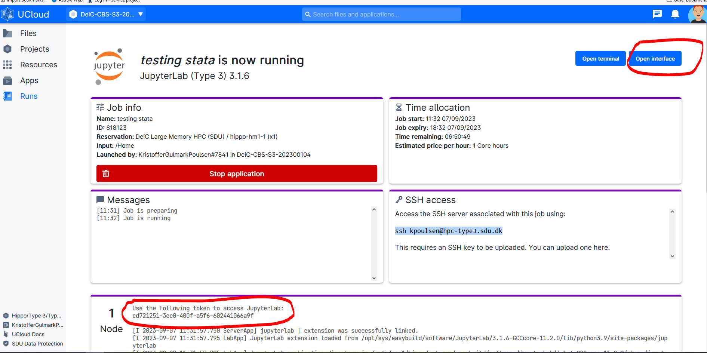
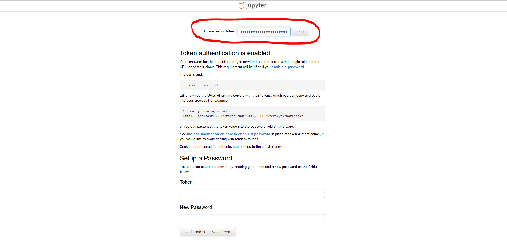
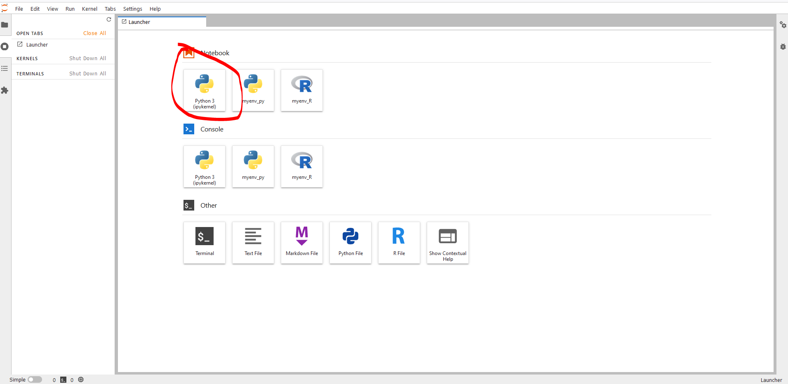

# DieC large memory HPC/TYPE 3 (Hippo): Use Conda for easy management of Python and R environments

https://docs.cloud.sdu.dk/hands-on/conda-setup.html?highlight=conda

The Conda package and environment management system is already included in few applications available on UCloud (see, e.g., JupyerLab and PyTorch). For more general uses of Conda and its powerful package manager it is convenient to create a local installation and save it in a UCloud project.
Conda is included in all versions of Anaconda and Miniconda. For example, to install the latest version of Miniconda, just start any interactive app on UCloud, such as Terminal, and run the following shell commands:

## Install Conda on Type 3


```R
# Download miniconda 
curl -s -L -o /miniconda_installer.sh https://repo.anaconda.com/miniconda/Miniconda3-latest-Linux-x86_64.sh

# Install miniconda
bash miniconda_installer.sh -b -f -p miniconda3
```

## Activating Conda in a new UCloud Job


```R
# Set miniconda3 to path
export PATH="$HOME/miniconda3/bin:$PATH"

# activate Conda
source $HOME/miniconda3/bin/activate

# Initiate Conda
conda init && bash -i
```

## Install Python or R environments using Conda


```R
# Python
conda create -n myenv_py python
conda activate myenv_py
conda install ipykernel
ipython kernel install --name myenv_py --user # Make python available to JupyterLab

# R
conda create --solver=libmamba -n myenv_R -y -c conda-forge r-base=4.2.1 #
conda activate myenv_R
conda install -c conda-forge r-irkernel
conda install jupyterlab
R -e "IRkernel::installspec(name = 'myenv_R', displayname = 'myenv_R')" # Make R available to JupyterLab
```

## Start Jupyter interface


## Add token to open jupyter


## Now the conda environments are available as a Jupyter Kernel

