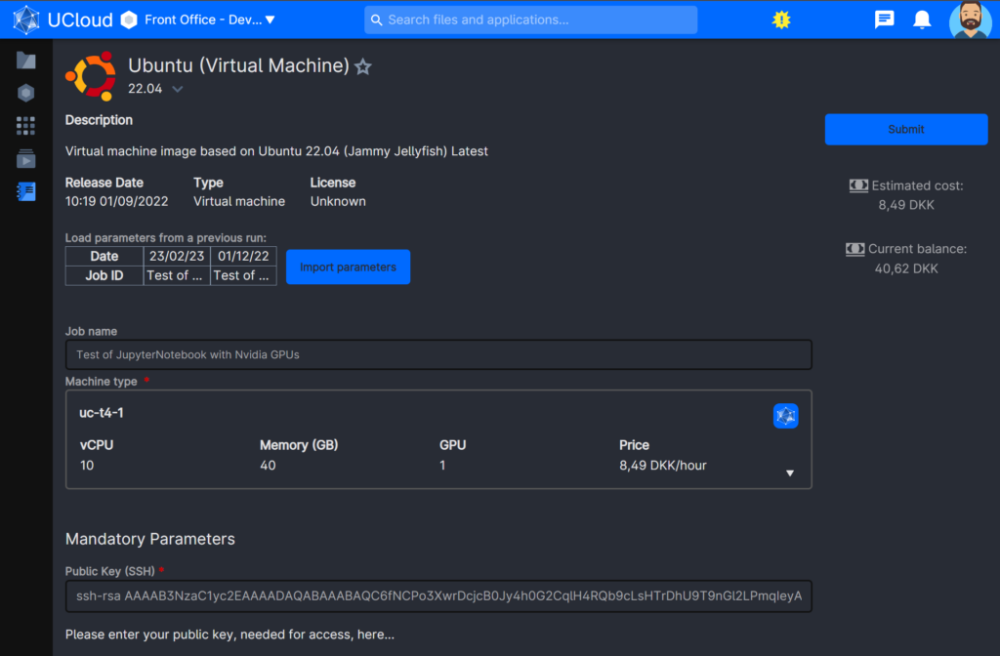
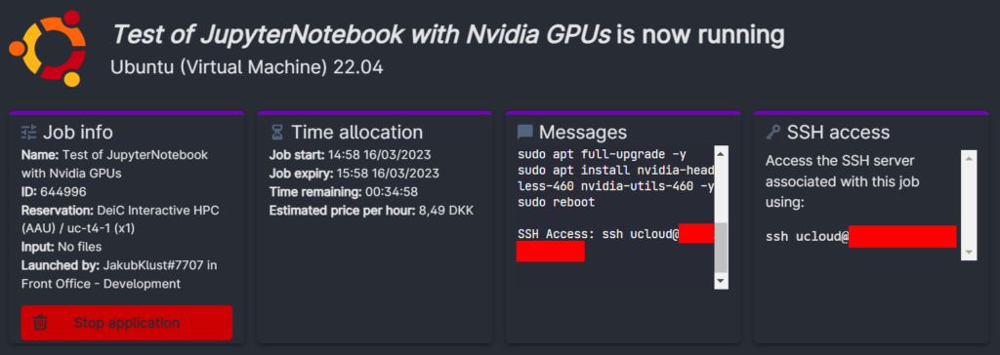

# SSH to Server through local Terminal

Add public SSH key while starting a VM job




Identify VM IP when UCloud job is ready.




## From Local Terminal connect to VM by:


```R
ssh ucloud@IP_address_from_the_red_mark
```

# Transfer Files and Folders (SSH-Copy)

## To VM

Open a second terminal (1st terminal is connected to the VM):


```R
scp -r "C:\path-to-folder-or-files" ucloud@IP_address_from_the_red_mark:
```

## From VM

Open a second terminal (1st terminal is connected to the VM)


```R
scp -r ucloud@IP_address_from_the_red_mark:/home/ucloud/folder "C:\path-to-folder"
```
