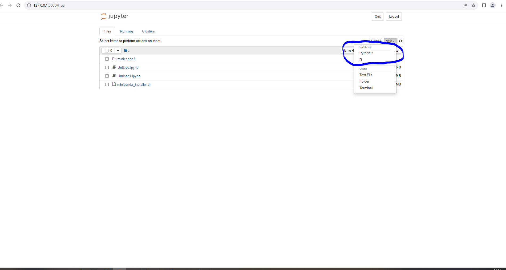
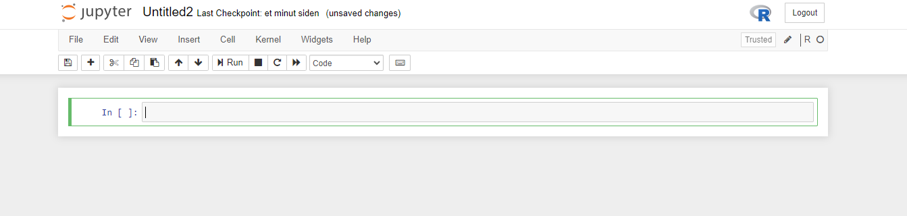

# Run Python and R jupyter notebooks on AAU VMs

Prerequisite reading:

- [How to Generate SSH key](/Tutorials/VMs/shh/)

- [Access VM using SSH](/Tutorials/VMs/connectVM/)

- [Conda: for easy workflow deployment on AAU GPU VMs](/Tutorials/VMs/condaVM/)

### Connect to VM using SSH

Open a terminal app on local machine and SSH onto the VM:


```R
ssh ucloud@IP_address_from_the_red_mark
```

## Install or activate Conda installation

See ["Conda: for easy workflow deployment on AAU GPU VMs"](/Tutorials/VMs/condaVM/) for more information.

## Install and/or activate existing Python or R Environment using Conda


```R
# Python 
conda deactivate
conda create --name my_env python
conda activate my_env

# R 
conda deactivate
mamba create --solver=libmamba -n myenv -y -c conda-forge r-base
conda activate my_env
conda install -c conda-forge r-irkernel

# Install cudatoolkit and cudnn
conda install -c conda-forge cudatoolkit cudnn

# Set pre-installed conda libraries to path
export LD_LIBRARY_PATH=$LD_LIBRARY_PATH:$CONDA_PREFIX/lib/
```

### Install jupyter if needed: 


```R
# Using pip
pip install jupyterlab

# Using conda if conda environment are utilised 
conda install jupyterlab
```

### Make sure jupyter is installed

In this case jupyter is installed and activated through a conda environment. Please see 


```R
which jupyter

# Example Output:
/home/ucloud/miniconda3/envs/my_env/bin/jupyter
```

### R Kernel available to Jupyter


```R
# Activate R
R

# R command
IRkernel::installspec()

# Activate R
quite()
```

### Start Jupyter Notebook from remote server


```R
jupyter notebook --no-browser --port=8080

# Output

[I 10:26:32.873 NotebookApp] Serving notebooks from local directory: /home/ucloud
[I 10:26:32.873 NotebookApp] The Jupyter Notebook is running at:
[I 10:26:32.873 NotebookApp] http://localhost:8080/?token=b754cbea9f5a6640e647f21c7d2e7112a6954eb26f032d73
[I 10:26:32.873 NotebookApp]  or http://127.0.0.1:8080/?token=b754cbea9f5a6640e647f21c7d2e7112a6954eb26f032d73
[I 10:26:32.873 NotebookApp] Use Control-C to stop this server and shut down all kernels (twice to skip confirmation).
[C 10:26:32.899 NotebookApp]

    To access the notebook, open this file in a browser:
        file:///home/ucloud/.local/share/jupyter/runtime/nbserver-3074-open.html
    Or copy and paste one of these URLs:
        http://localhost:8080/?token=b754cbea9f5a6640e647f21c7d2e7112a6954eb26f032d73
     or http://127.0.0.1:8080/?token=b754cbea9f5a6640e647f21c7d2e7112a6954eb26f032d73

```

### SSH connect to VM using a new terminal app on local machine

Open a 2nd instance of Terminal on Local machine


```R
ssh -L 8080:localhost:8080 ucloud@IP_address_from_the_red_mark
```

### Open Jupyter Notebook

Press the link in the output above and it should open a jupyter notebook

Now the R and Python kernel should be available (see figure below)




